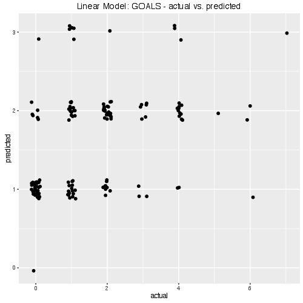
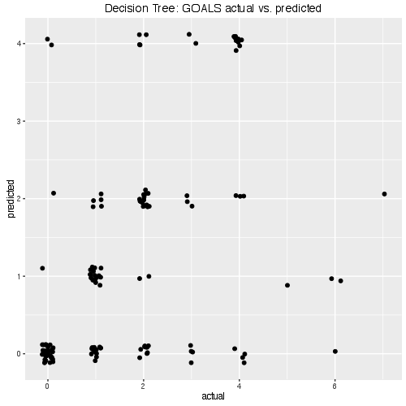
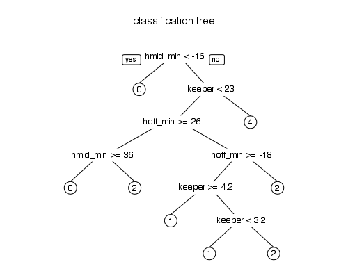

# soccer-cs-prediction
Prediction modelling playground for soccer championship data.

### data source
* match results and starting 11 from [Fußballdaten](http://www.fussballdaten.de)
* player's master data and market values from [Transfermarkt](http://www.transfermarkt.co.uk).

### data description
* dataset is described at [soccer-cs-stats](https://github.com/teeschke/soccer-cs-stats)

### hosting
* PostgresDB hosted on [heliohost](http://heliohost.org/)

### Linear Model



```{r}
new_data <- data.frame(h_complete_value=runif(5, min(matches$h_complete_value), max(matches$h_complete_value)), 
                       g_complete_value=runif(5, min(matches$g_complete_value), max(matches$g_complete_value)))
new_data$predicted_goals_home <- predict(lm.home, new_data)
new_data$predicted_goals_guest <- predict(lm.guest, new_data)
new_data$predicted_goals_diff <- predict(lm.diff, new_data)

  h_complete_value g_complete_value predicted_goals_home predicted_goals_guest predicted_goals_diff
1     207.36492255      310.8887837         1.5872048654           2.379296782        -0.7920919161
2      96.14086664      220.2366359         1.1044223911           2.053916107        -0.9494937161
3     295.13231173      210.8974470         2.2810360244           1.636529969         0.6445060556
4     107.49347650      246.5382373         1.1226026156           2.186475521        -1.0638729052
5      43.71422874      393.2400116         0.4833563614           3.157682298        -2.6743259364
```

### Decision Tree



