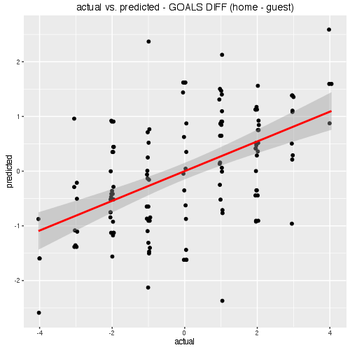
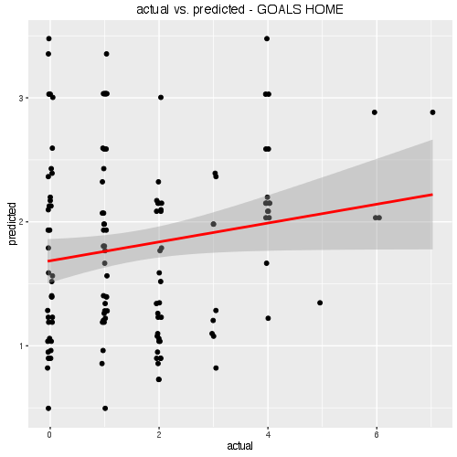
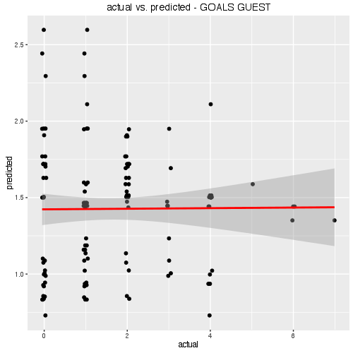

# soccer-cs-prediction
Prediction modelling playground for soccer championship data.

### data source
Data from [Fuflballdaten](http://www.fussballdaten.de) and [Transfermarkt](http://www.transfermarkt.co.uk). PostgresDB hosted at [heliohost](http://heliohost.org).

### content
Data contains currently 15 national teams[^1] with its 391 national players and its market values. 68 championship or quali matches from the last 10 years (2006-2016).

Dataset is descriped at [soccer-cs-stats](https://github.com/teeschke/soccer-cs-stats)

[^1]: list of national teams: BELGIUM, CROATIA, CZECH_REPUBLIC, ENGLAND, FRANCE, GERMANY, IRELAND, ITALY, POLAND, RUSSIA, SLOVAKIA, SPAIN, SWEDEN, SWITZERLAND, UKRAINE

### simple lm
Linear model of the team's plain market value on the pitch.






```{r}
new_data <- data.frame(h_complete_value=runif(5, min(matches$h_complete_value), max(matches$h_complete_value)), 
                       g_complete_value=runif(5, min(matches$g_complete_value), max(matches$g_complete_value)))
new_data$predicted_goals_home <- predict(lm.home, new_data)
new_data$predicted_goals_guest <- predict(lm.guest, new_data)
new_data$predicted_goals_diff <- predict(lm.diff, new_data)

  h_complete_value g_complete_value predicted_goals_home predicted_goals_guest predicted_goals_diff
1     207.36492255      310.8887837         1.5872048654           2.379296782        -0.7920919161
2      96.14086664      220.2366359         1.1044223911           2.053916107        -0.9494937161
3     295.13231173      210.8974470         2.2810360244           1.636529969         0.6445060556
4     107.49347650      246.5382373         1.1226026156           2.186475521        -1.0638729052
5      43.71422874      393.2400116         0.4833563614           3.157682298        -2.6743259364
```